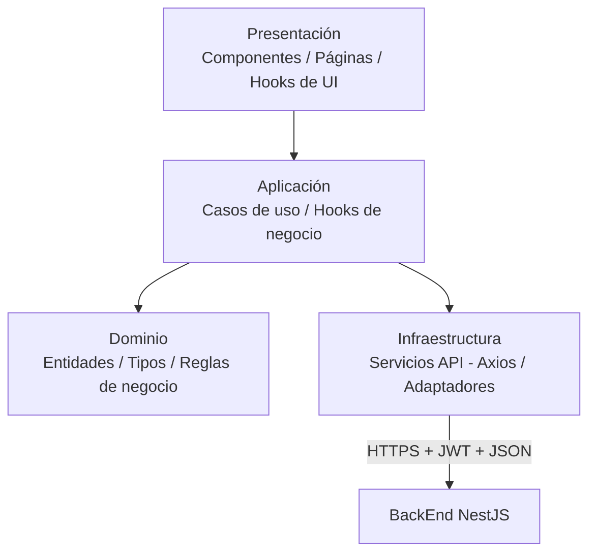

# PAEC Manager — FrontEnd

Aplicación web **Progressive Web App (PWA)** para la gestión de proyectos escolares bajo la metodología **ABP + Scrum + Design Sprint (Google)**, correspondiente al caso de estudio **"Gestión de Proyectos PAEC"**.

> Construida con **React + TypeScript**, bajo **Arquitectura Limpia orientada a módulos**, consumiendo la API RESTful del BackEnd (NestJS) mediante JSON.

---

## Descripción del proyecto

Sistema web orientado a la administración de proyectos PAEC del CBTis 75, basado en las metodologías **Aprendizaje Basado en Proyectos (ABP)**, **Design Sprint** y **Scrum**.

El objetivo es digitalizar la planeación, seguimiento y evaluación de proyectos académicos mediante herramientas como tableros Kanban, gestión de Sprints, Dailies, reportes y métricas.

Interfaz web/móvil (PWA) que permite a **docentes**, **Scrum Masters** y **alumnos**:

- Consultar la introducción a las metodologías **ABP** y **Scrum**.
- Registrar equipos, nombre del proyecto y roles ágiles de cada integrante.
- Dar seguimiento visual al **Design Sprint** (mapear, bocetar, decidir, prototipar, probar) con carga de evidencias.
- Planear y trabajar sobre un **tablero Kanban** por sprint, con aprobación del Scrum Master.
- Registrar **Dailies** individuales y visualizar acuerdos del equipo.
- Visualizar reportes de avance: histograma por equipo, esfuerzo por integrante, story points planificados vs. completados, diagrama de Gantt y horas-persona disponibles.
- Recibir alertas cuando el equipo no cumple entregas en tiempo y forma.

---

## Antecedentes

Al inicio de cada semestre, la coordinación de docentes del CBTis 75 define una temática para desarrollar proyectos PAEC.

Actualmente el proceso se realiza de manera manual o mediante diversas herramientas dispersas, lo que dificulta el seguimiento de:

- Equipos
- Roles Scrum
- Planeación
- Evidencias
- Avances
- Evaluaciones

Por ello surge la necesidad de desarrollar una plataforma digital que centralice todo el ciclo de vida del proyecto.

---

## Objetivos

- Centralizar la gestión de proyectos.
- Automatizar la metodología Scrum.
- Guiar el proceso de Design Sprint.
- Facilitar la evaluación docente.
- Visualizar métricas del proyecto.

---

## Problemática

- Falta de control centralizado.
- No existe una herramienta para Design Sprint.
- Difícil medir esfuerzo individual.
- Falta de alertas automáticas.
- Registro desorganizado de Dailies.

---
## Requerimientos

### Requerimientos Funcionales

| ID | Requerimiento |
|----|---------------|
| RF1 | Gestión de equipos |
| RF2 | Flujo Design Sprint |
| RF3 | Planeación de Sprint |
| RF4 | Aprobación docente |
| RF5 | Registro de Dailies |
| RF6 | Tablero Kanban |
| RF7 | Sistema de Alertas |
| RF8 | Métricas y Reportes |

### Requerimientos No Funcionales

- Diseño Responsive (Mobile First)
- Alta disponibilidad
- Tiempo de carga menor a 2 segundos
- Control de permisos por roles
- Persistencia en tiempo real

---

## Mapa del Sitio

```text
Inicio
│
├── Introducción ABP
├── Mis Proyectos
├── Mis Equipos
│
├── Design Sprint
│   ├── Mapear
│   ├── Bocetar
│   ├── Decidir
│   ├── Prototipar
│   └── Probar
│
├── Workspace
│   ├── Product Backlog
│   ├── Sprint
│   ├── Kanban
│   └── Daily Scrum
│
└── Analíticas
    ├── Histogramas
    ├── Gantt
    └── Story Points
```
---

## Stack tecnológico

| Elemento | Tecnología |
|---|---|
| Librería UI | React 18+ con TypeScript |
| Enrutamiento | React Router |
| Estado global | Context API / Zustand (según módulo) |
| Consumo de API | Axios (con interceptores para JWT) |
| Formularios y validación | React Hook Form + Zod/Yup |
| Estilos | CSS Modules / Tailwind |
| PWA | Vite PWA plugin (service worker, manifest) |
| Contenedores | Docker + Docker Compose |
| CI/CD | GitHub Actions |
| Testing | Jest + React Testing Library |

## Arquitectura

**Arquitectura limpia enfocada en módulos** (feature-based clean architecture): cada módulo de negocio encapsula sus propias capas de dominio, aplicación, infraestructura y presentación, evitando dependencias cruzadas directas.



- **Dominio:** tipos e interfaces puros (p. ej. `Equipo`, `ActividadKanban`, `Daily`), sin dependencias externas.
- **Aplicación:** casos de uso/hooks que orquestan reglas (`useAprobarSprint`, `useRegistrarDaily`).
- **Infraestructura:** adaptadores concretos hacia la API (repositorios HTTP), intercambiables sin tocar el dominio.
- **Presentación:** componentes React que solo consumen hooks de aplicación, sin lógica de negocio embebida.


## Estructura de carpetas

```
src/
├── app/
│   ├── App.tsx
│   ├── routes.tsx
│   ├── store.ts
│   ├── providers.tsx
│   └── theme.ts
├── assets/
├── components/
│   ├── Button/
│   ├── Modal/
│   ├── Table/
│   ├── Card/
│   ├── Input/
│   ├── Navbar/
│   ├── Sidebar/
│   ├── Loader/
│   ├── ConfirmDialog/
│   └── Charts/
├── hooks/
├── layouts/
│   ├── AuthLayout.tsx
│   └── DashboardLayout.tsx
├── services/
│   ├── api.ts
│   ├── auth.service.ts
│   ├── proyecto.service.ts
│   ├── sprint.service.ts
│   ├── kanban.service.ts
│   └── reporte.service.ts
├── utils/
├── types/
├── context/
├── modules/
│   ├── auth/
│   ├── dashboard/
│   ├── metodologias/
│   ├── proyectos/
│   ├── equipos/
│   ├── designSprint/
│   ├── planeacion/
│   ├── sprints/
│   ├── tareas/
│   ├── kanban/
│   ├── evidencias/
│   ├── daily/
│   ├── retroalimentacion/
│   ├── alertas/
│   ├── reportes/
│   ├── profesor/
│   ├── alumno/
│   └── admin/
└── main.tsx
```

## Módulos funcionales

| Módulo | Responsabilidad |
|---|---|
| `auth` | Login, manejo de sesión, JWT en memoria/cookie segura |
| `equipos` | Registro de equipos, roles ágiles, integrantes |
| `design-sprint` | Seguimiento de las 5 fases del Design Sprint |
| `sprints-kanban` | Planeación de sprint y tablero Kanban |
| `dailies` | Registro y consulta de dailies por equipo |
| `reportes` | Gantt, story points, esfuerzo por integrante, histograma |

## Seguridad y privacidad en el cliente

Conforme a la **Ley General de Protección de Datos Personales en Posesión de Sujetos Obligados** y **OWASP**:

- **Aviso de privacidad** visible y accesible antes de cualquier captura de datos personales (registro de integrantes, avances).
- **HTTPS estricto** (TLS 1.3) en todos los ambientes.
- **Cookies seguras** (`Secure`, `HttpOnly`, `SameSite=Strict`) para el token de sesión; se evita `localStorage` para datos sensibles.
- **Minimización de datos:** solo se envían al BackEnd los campos estrictamente necesarios del formulario.
- **Sanitización de entradas** en formularios (dailies, comentarios de evidencia) para mitigar XSS; el BackEnd revalida siempre.
- **Protección contra Clickjacking:** cabeceras `X-Frame-Options` / `Content-Security-Policy` configuradas en el despliegue.
- **Consentimiento explícito:** casillas de verificación no pre-marcadas al capturar datos sensibles.
- **Las validaciones del cliente no sustituyen** las del servidor (defensa en profundidad).

## Consumo de la API

Comunicación estrictamente en **JSON** sobre HTTPS, con JWT en cabecera `Authorization: Bearer <token>`.

```ts
// shared/config/httpClient.ts
export const httpClient = axios.create({
  baseURL: import.meta.env.VITE_API_URL,
  timeout: 8000,
});

httpClient.interceptors.request.use((config) => {
  const token = authStorage.getToken();
  if (token) config.headers.Authorization = `Bearer ${token}`;
  return config;
});
```

## Variables de entorno

```env
VITE_API_URL=http://localhost:3000/api/v1
VITE_APP_ENV=development
```

## Ejecución local (Docker)

```bash
# 1. Clonar el repositorio
git clone <url-del-repositorio>
cd frontend

# 2. Copiar variables de entorno
cp .env.example .env

# 3. Levantar el entorno
docker-compose up --build

# La aplicación queda disponible en http://localhost:5173
```

> El `docker-compose.yml` general del proyecto (raíz del repositorio) puede levantar FrontEnd + BackEnd + bases de datos con un solo comando.

## CI/CD (GitHub Actions)

Workflow (`.github/workflows/frontend-ci.yml`) disparado en cada Pull Request hacia `develop` o `main`:

1. Instalación de dependencias (`npm ci`).
2. Linter (`eslint`) y verificación de tipos (`tsc --noEmit`).
3. Pruebas unitarias (`jest`).
4. Build de producción (`vite build`).
5. **CD:** despliegue automático al fusionar en `main` (Render/Railway/AWS/Azure/GCP), con HTTPS activo.

## Pruebas

```bash
npm run test        # Unitarias (componentes y hooks)
npm run test:cov    # Cobertura
```

## Credenciales de prueba

| Rol | Correo | Contraseña |
|---|---|---|
| - | - | - |

## Flujo de trabajo Git

- **GitFlow:** ramas `main`, `develop`, `feature/*`.
- Prohibido push directo a `main`/`develop`; todo cambio vía **Pull Request** aprobado por al menos otro integrante, con pruebas automatizadas en verde.

## Integrantes del equipo

| Nombre | Número de control | Rol en el equipo |
|---|---|---|
| — | — | Scrum Master |
| — | — | Desarrollador |
| — | — | Desarrollador |
| — | — | Desarrollador |

## Referencias

OWASP. (2024). *Source Code Analysis Tools*. OWASP. https://owasp.org/www-community/Source_Code_Analysis_Tools

OWASP. (2024). *Vulnerability Scanning Tools*. OWASP. https://owasp.org/www-community/Vulnerability_Scanning_Tools

Wichers, D. (s.f.). *Free for Open Source Application Security Tools*. OWASP. https://owasp.org/www-community/Free_for_Open_Source_Application_Security_Tools
